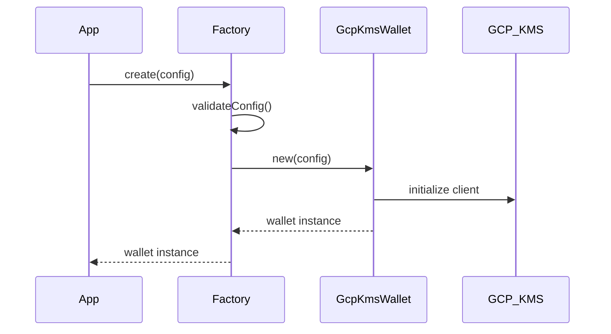
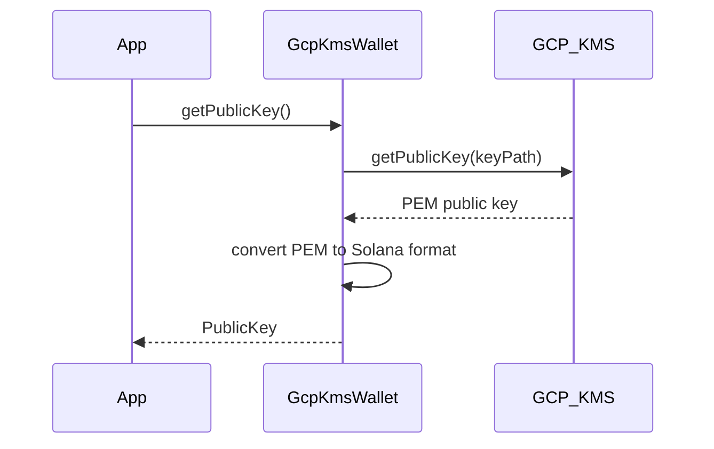
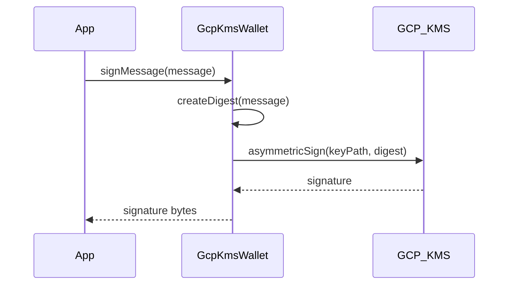
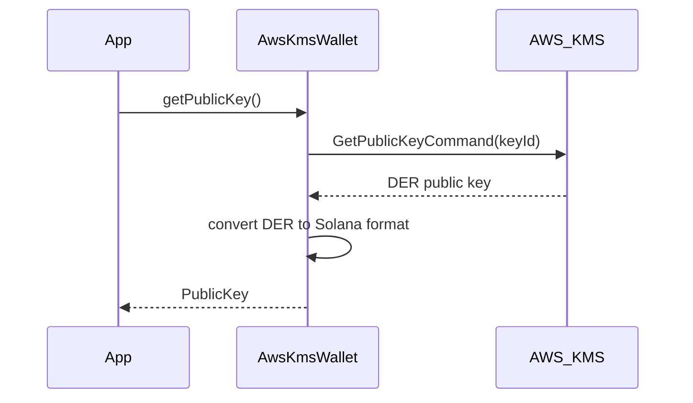
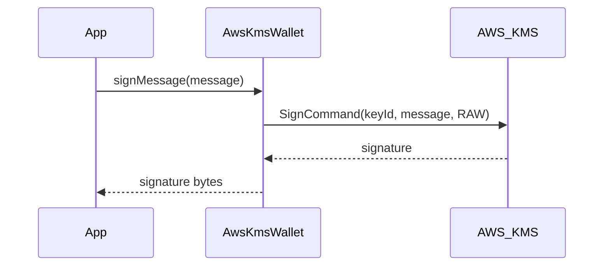

# Cloud Wallet Architecture

This document describes the architecture and design decisions for Solder's Cloud Wallet integration system.

## Overview

The Cloud Wallet system provides a unified interface for managing Solana wallets using cloud-based key management services. The current implementation supports Google Cloud Platform (GCP) Key Management Service (KMS) and Amazon Web Services (AWS) KMS, with plans for Azure Key Vault.

## Architecture Diagram

```
┌─────────────────────────────────────────────────────────────────┐
│                        Solder Cloud Wallet                      │
├─────────────────────────────────────────────────────────────────┤
│  ┌─────────────────┐    ┌─────────────────┐                     │
│  │   Factory       │    │   Types &       │                     │
│  │   Pattern       │    │   Interfaces    │                     │
│  └─────────────────┘    └─────────────────┘                     │
├─────────────────────────────────────────────────────────────────┤
│  ┌─────────────────┐    ┌─────────────────┐    ┌─────────────┐  │
│  │   GCP KMS       │    │   AWS KMS       │    │   Azure     │  │
│  │   Provider      │    │   Provider      │    │   Provider  │  │
│  │   (Current)     │    │   (Current)     │    │   (Future)  │  │
│  └─────────────────┘    └─────────────────┘    └─────────────┘  │
├─────────────────────────────────────────────────────────────────┤
│  ┌─────────────────┐    ┌─────────────────┐                     │
│  │   GCP KMS       │    │   AWS KMS       │                     │
│  │   API           │    │   API           │                     │
│  └─────────────────┘    └─────────────────┘                     │
├─────────────────────────────────────────────────────────────────┤
│  ┌─────────────────┐                                            │
│  │   @solana/kit   │                                            │
│  │   Integration   │                                            │
│  └─────────────────┘                                            │
└─────────────────────────────────────────────────────────────────┘
```

## Core Components

### 1. Factory Pattern (`CloudWalletFactory`)

The factory pattern provides a unified interface for creating cloud wallets:

```typescript
// GCP KMS
const gcpWallet = CloudWalletFactory.create({
  provider: 'gcp',
  projectId: 'my-project',
  location: 'global',
  keyRing: 'my-key-ring',
  keyName: 'my-key',
  keyFilename: './service-account.json'
});

// AWS KMS
const awsWallet = CloudWalletFactory.create({
  provider: 'aws',
  region: 'us-east-1',
  keyId: 'arn:aws:kms:us-east-1:123456789012:key/12345678-1234-1234-1234-123456789012'
});
```

**Benefits:**
- Single entry point for all providers
- Type-safe configuration validation
- Easy to extend with new providers
- Consistent error handling

### 2. Provider Interface (`CloudWallet`)

All cloud wallet providers implement the `CloudWallet` interface:

```typescript
interface CloudWallet {
  getPublicKey(): Promise<PublicKey>;
  getAddress(): Promise<string>;
  signMessage(message: Uint8Array): Promise<Uint8Array>;
  signTransaction(transactionMessage: Uint8Array): Promise<Uint8Array>;
  getSigner(): CloudWalletSigner;
  getProvider(): CloudWalletProvider;
}
```

**Benefits:**
- Consistent API across all providers
- Compatible with `@solana/kit` signer interface
- Easy to mock for testing
- Clear separation of concerns

### 3. Cloud Provider Implementations

#### GCP KMS Provider (`GcpKmsWallet`)
The GCP KMS implementation handles:
- **Key Retrieval**: Fetches public key from KMS and converts to Solana format
- **Message Signing**: Signs arbitrary messages using KMS asymmetric sign
- **Transaction Signing**: Signs Solana transaction messages
- **Error Handling**: Provides detailed error information

#### AWS KMS Provider (`AwsKmsWallet`)
The AWS KMS implementation handles:
- **Key Retrieval**: Fetches public key from AWS KMS and converts to Solana format
- **Message Signing**: Signs arbitrary messages using AWS KMS SignCommand
- **Transaction Signing**: Signs Solana transaction messages
- **Error Handling**: Provides detailed error information with AWS context

## Cloud Provider Integration Flows

### GCP KMS Integration Flow

### 1. Initialization



### 2. Public Key Retrieval



### 3. Message Signing



### AWS KMS Integration Flow

#### 1. Initialization


#### 2. Public Key Retrieval



#### 3. Message Signing



## Key Design Decisions

### 1. Factory Pattern vs Direct Instantiation

**Decision**: Factory pattern with `CloudWalletFactory.create()`

**Rationale**:
- Provides unified interface across providers
- Enables configuration validation
- Makes it easy to add new providers
- Follows common design patterns

### 2. Ed25519 Algorithm Requirement

**Decision**: Require Ed25519 keys for GCP KMS

**Rationale**:
- Solana uses Ed25519 for all cryptographic operations
- Other algorithms (RSA, ECDSA) are not compatible
- GCP KMS supports Ed25519 with `EC_SIGN_ED25519` algorithm

### 3. Public Key Caching

**Decision**: Cache public key after first retrieval

**Rationale**:
- Public keys don't change frequently
- Reduces KMS API calls
- Improves performance for multiple operations

### 4. Error Handling Strategy

**Decision**: Custom error classes with provider context

**Rationale**:
- Provides clear error information
- Enables provider-specific error handling
- Maintains stack traces for debugging
- Follows TypeScript best practices

## Security Considerations

### 1. Key Storage

- **Private keys**: Never stored locally, always in cloud KMS
- **Public keys**: Cached in memory only
- **Credentials**: Stored securely (environment variables, IAM roles)

### 2. Access Control

- **Service accounts**: Use least-privilege IAM roles
- **Key permissions**: Only sign/verify operations
- **Network security**: Consider VPC restrictions

### 3. Audit Trail

- **KMS operations**: All signing operations logged
- **Access patterns**: Monitor unusual usage
- **Key rotation**: Implement regular key rotation

## Performance Characteristics

### 1. Latency

- **KMS operations**: 100-500ms typical latency
- **Public key retrieval**: ~200ms first time, cached thereafter
- **Message signing**: ~300ms per operation

### 2. Throughput

- **Concurrent operations**: Limited by KMS quotas
- **Rate limiting**: GCP KMS has per-key rate limits
- **Batching**: Not supported for signing operations

### 3. Caching Strategy

- **Public keys**: Cached in memory
- **Signatures**: Not cached
- **Credentials**: Cached by GCP client library

## Future Extensions

### 1. Additional Providers

**AWS KMS Provider**:
```typescript
const wallet = CloudWalletFactory.create({
  provider: 'aws',
  region: 'us-east-1',
  keyId: 'arn:aws:kms:us-east-1:123456789012:key/12345678-1234-1234-1234-123456789012'
});
```

**Azure Key Vault Provider**:
```typescript
const wallet = CloudWalletFactory.create({
  provider: 'azure',
  vaultUrl: 'https://myvault.vault.azure.net/',
  keyName: 'solana-key'
});
```

### 2. Advanced Features

- **Key rotation**: Automatic key version management
- **Multi-signature**: Support for multiple cloud providers
- **Transaction simulation**: Pre-flight transaction validation
- **Webhook notifications**: Real-time operation status

### 3. Performance Optimizations

- **Connection pooling**: Reuse KMS client connections
- **Batch operations**: Group multiple operations
- **Regional failover**: Automatic failover between regions

## Testing Strategy

### 1. Unit Tests

- **Provider isolation**: Test each provider independently
- **Mock KMS**: Use mocked KMS responses
- **Error scenarios**: Test all error conditions

### 2. Integration Tests

- **Real KMS**: Test with actual GCP KMS (dev environment)
- **End-to-end**: Test complete transaction flow
- **Performance**: Measure latency and throughput

### 3. Security Tests

- **Penetration testing**: Test for security vulnerabilities
- **Access control**: Verify IAM permissions
- **Audit logging**: Ensure proper logging

## Monitoring and Observability

### 1. Metrics

- **Operation latency**: Track KMS operation times
- **Success/failure rates**: Monitor operation success
- **Key usage**: Track key rotation and usage patterns

### 2. Logging

- **Structured logging**: JSON format with context
- **Security events**: Log all signing operations
- **Error tracking**: Detailed error information

### 3. Alerting

- **High latency**: Alert on slow operations
- **Failure rates**: Alert on operation failures
- **Security events**: Alert on suspicious activity

## Conclusion

The Cloud Wallet architecture provides a secure, scalable, and extensible foundation for cloud-based Solana wallet management. The factory pattern enables easy addition of new cloud providers while maintaining a consistent API. The GCP KMS implementation demonstrates the architecture's effectiveness and provides a solid foundation for future enhancements.
